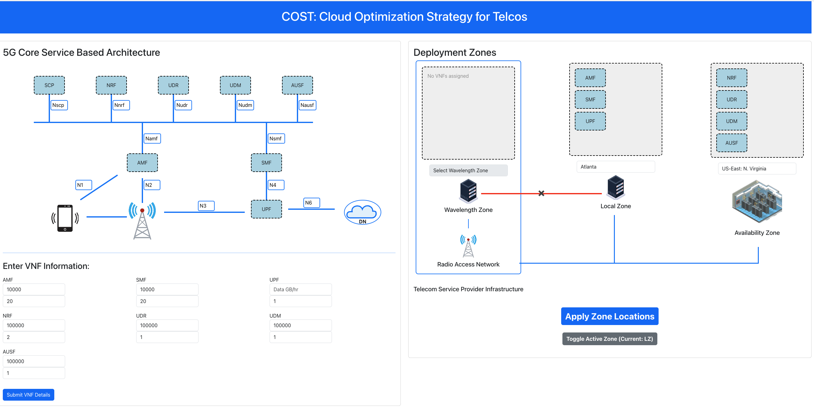
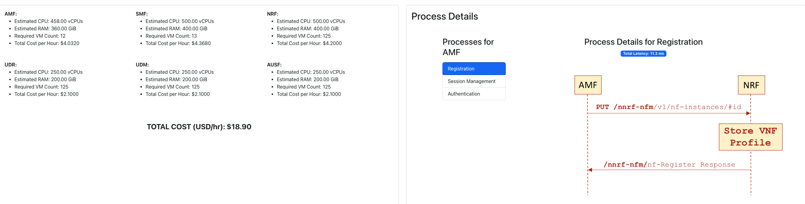

# COST: Cloud Optimization Strategy for Telcos

COST (Cloud Optimization Strategy for Telcos) is a tool designed to help telecommunications providers optimize the deployment and operational costs of their 5G core services across various cloud zones. This platform enables the strategic placement of VNFs (Virtual Network Functions) across different cloud zones, provides real-time latency calculations for VNF interactions, and gives insights into the estimated costs and resource requirements for each VNF deployment. 


## Features


### Quadrant 1. **5G Core Service-Based Architecture Visualization**
   - This section provides a visual overview of the 5G Core Service Architecture, and the VNFs. 
   - The user can drag and drop the VNFs from the 5G core SBA into the Deployment Zones panel to create different topologies. 

### Quadrant 2. **Deployment Zones Selection**
   - **Wavelength Zone**, **Local Zone**, and **Availability Zone** options are available to deploy VNFs.
   - Users can drag and drop VNFs into these zones, choosing between geographical locations like "Atlanta" or "US-East: N. Virginia."
   - This feature allows users to experiment with different deployment strategies and observe their impact on latency and operational costs.
   - In the current AWS environment, LZs and WZ are not interconnected, thus the tool only allows activating one zone type at a time. 


### Quadrant 3. **VNF Information Input and Cost Calculation**
   - Users can enter specific information for each VNF, such as estimated requests/minute for control plane VNFs and GB/hr data volume for the UPF. 
   - The tool calculates and displays resource requirements, including vCPU, RAM, and VM counts based on a reference AWS instance.
   - A **Total Cost per Hour** calculation for each VNF is shown, with a grand total summarizing all deployment costs.

### Quadrant 4. **Process Details and Latency Calculation**
   - Users can select a specific VNF (e.g., AMF) and view the processes associated with that VNF (e.g., Registration, Session Management, Authentication).
   - The selected process's sequence diagram is displayed, showing the HTTP message flow and associated steps.
   - **Total Latency** for the selected process is calculated dynamically based on VNF locations and displayed above the diagram.
   - This feature provides valuable insights into latency impacts for different configurations.

## How to Use

1. **Configure Deployment Zones:**
   - Select different cloud zones (Wavelength, Local, and Availability) for each VNF by dragging them into the desired zone.
   - Use the dropdown menus to select specific locations within each zone.

2. **Input VNF Details:**
   - Fill in the required data for each VNF, including CPU, RAM, and data usage estimates.
   - Click **Submit VNF Details** to calculate and display cost estimates for each VNF and the total deployment cost.

3. **View and Analyze Process Details:**
   - Select a VNF from the **Processes for [VNF]** panel to see the associated processes.
   - Click on a process to view the message flow and latency calculation for that specific process.
   - The **Total Latency** for each process is displayed, allowing users to understand how different zone deployments affect latency.

## Starting

### React Front-end
```
cd vnf-demo;
rm package-lock.json;
npm install;
npm start;
```
The application will start on http://localhost:3000


### Back-end Server
```
cd backend;
npm start;
```
The application will start on http://localhost:3000


```
cd vnf-demo;
rm package-lock.json;
npm install;
npm start;
```
The application will start on http://localhost:3000
